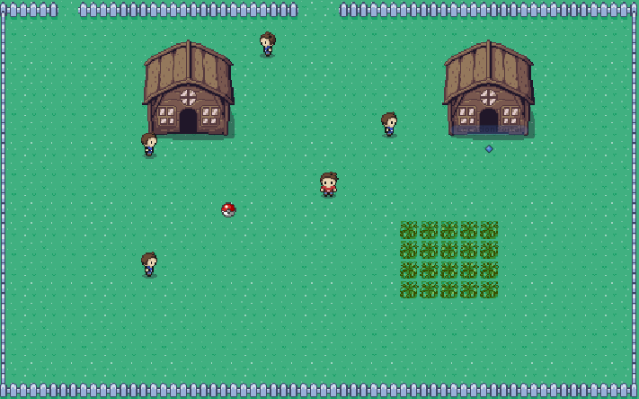
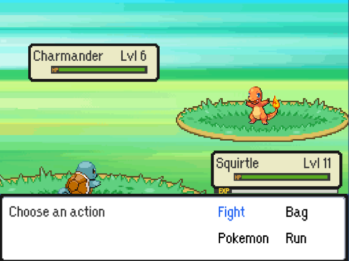

# Pokemon-Style Game 2D (Unity)

This repository and README is currently under construction.

## Introduction
The goal of this project is to make a playable Pokemon-style game that allows people to be exposed to the variety of pokemon more quickly and hopefully speeds the process of training, catching pokemon. This will then lead to a difficult a battle challenge.

This is an example of the environment.

This is an example of the battle system.

## Acknowledgements
* Much credit to [Game Dev Experiments YouTube Tutorial](https://www.youtube.com/playlist?list=PLLf84Zj7U26kfPQ00JVI2nIoozuPkykDX) for in depth tutorials
* Through him, also credit to GameDev.Tv for the saving system implementation.

I DO NOT CLAIM ANY SPRITES AS MY OWN. ALL SPRITES BELONG TO POKEMON COMPANY AND ARE USED FOR NON-COMMERCIAL, PERSONAL USE.

## Next Steps
As of 10/13/2022, this project has followed along with Game Dev Experiment's tutorial up to and including #70.
* ~~Implementing Flinch condition~~ (Implemented 2022/10/5)
* ~~Implementing Leech Seed condition~~ (Implemented 2022/10/7)
* ~~Update volatile effects to allow to be affected together like leech seed and confusion~~ (Implemented 2022/10/7)
* ~~Refactor dialogue system (Expected 2022/10/12)~~ (Implemented 2022/10/11)
* ~~Add item pickup and NPC giving items (Expected 2022/10/12)~~ (Implemented 2022/10/11)
* ~~Allow items to be saved (Expected 2022/10/13)~~ (Implemented 2022/10/12)
* ~~Implement quest system (Expected 2022/10/14)~~ (Implemented 2022/10/13)
* ~~Allow quests to be saved (Expected 2022/10/14)~~ (Implemented 2022/10/14)
* Implement pokemon evolutions (Expected 2022/10/15)
* Implement healing and shops (Expected 2022/10/16)
* Implement pokemon storage (Expected 2022/10/17)
* General Improvements (2022/10/18 - 2022/10/31)
    * Update opponent pokemon move loader logic
    * Make a smooth update for HP bar when item used in party screen
    * Scene management
* Implementing Pokemon abilities (Expected 2022/11/1)
* Implementing weather conditions (Expected 2022/11/1)
* Including Yes/No dialog box for new moves for confirmation (TBD)
* Including a settings menu item (TBD)
* Baby Maker (No eggs, but transform current pokemon into a level 1 version of either itself or it's lowest evolution) (TBD)
* Update TM Party Screen UI to leverage colors instead of text (TBD)

## Pokemon Universe Resource Expansion
* Caterpie (2022/10/7)
* Metapod (2022/10/7)
* Weedle (2022/10/7)
* Kakuna (2022/10/7)
* Beedrill (2022/10/7)
* Pidgey (2022/10/7)

## Move Universe Resource Expansion
* Added Leech Seed  (2022/10/7)
* Added Seed Bomb   (2022/10/7)
* Added Fire Fang (2022/10/7)
* Added Water Pulse (2022/10/7)
* String Shot (2022/10/7)
* Bug Bite (2022/10/7)
* Harden (2022/10/7)
* Poison Sting (2022/10/7)
* Gust (2022/10/7)
* Sand Attack (2022/10/7)

## Known Issues
* Fix bug where two characters can walk through each other if the motion is active before collision detection occurs
* ~~Fix bug where action selection box is still active when using a pokeball (and possibly item)~~ (Fixed 2022/10/10)
* ~~Fix bug where using a pokeball during a trainer battle decrements the pokeball count and skips to the opponents turn~~ (Fixed 2022/10/10)
* ~~Fix bug where spamming continue key upon learning TM move creates and error~~ (2022/10/10: possibly fixed, unable to recreate issue)
* Fix bug where player cannot cancel out of TM learn move state (with escape key) (2022/10/10: Deemed Low Priority since player can select the new move to cancel out, would want to allow escape key to leave as well though)
* ~~Fix bug where the name of TMs (possibly items in general) are cut off in bag~~ (Fixed 2022/10/10)

## Known Inconsistencies with Pokemon Games
* ~~Fix where statuses should be checked after all moves are completed~~ (Fixed 2022/10/7)
* ~~Fix where volatile status conditions should be cleared when switching pokemon~~ (Fixed 2022/10/7)
* Fix where TMs are not sorted by name (currently via pickup) (deal with this upon implementing pickup)

## Maintained Discrepancies
* As with new version of the games, there will be no HMs. TMs will also be reusable.

## World Planning
1. Generation 1 Home - Starter Pokemon
    * Tier 1 Wild Pokemon, e.g. Caterpie, Pidgey
    * Includes healer and shop
2. Generation 1 Tier 1 Battle Tower
    * 10 trainers
    * Player party healed after every battle
    * Player gains money upon each win
    * Player loses money upon each loss
    * Trainer party levels will be the max of the player party's level or 10(?)
    * 10 consecutive wins unlocks next area
3. Generation 1 Safari
    * All remaining pokemon, e.g. Lapras, Dratini
    * Legendary pokemon with reduced spawn rate, e.g. Mewtwo, Zapdos
4. Generation 1 Tier 2 Battle Tower
    * 20 trainers consecutive
    * Rest is same as generation 1
5. Generation 2 Home - Starter Pokemon
    * Begin same concept for generation 1
    * Player resets but can return to play more generation 1 if desired
    * How to handle evolutions across multiple generations then? (TBD)
6. Generation 2 Tier 1 Battle Tower
7. Generation 2 Safari
8. Generation 2 Tier 2 Battle Tower
9. Generation 3 Home - Starter Pokemon
10. ...

## Author(s)
* Primary Contributor(s): Eric Li